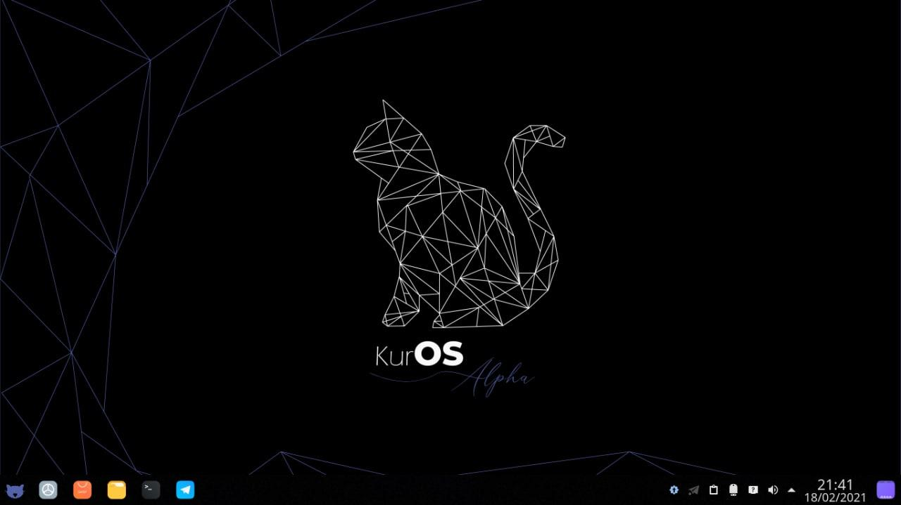
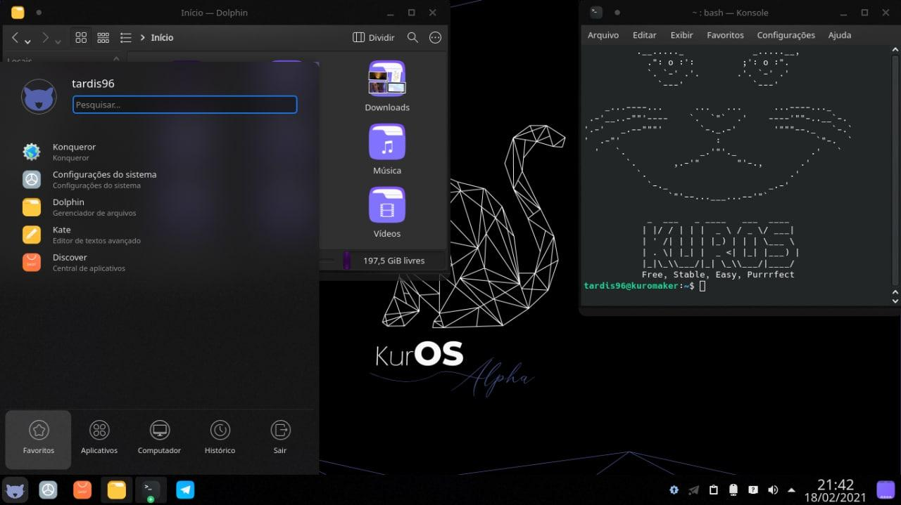

# KurOS

> _"Linux de verdade para programadores de verdade."_  
> — Vinicius Monfre

  
 Imagem 

  

## Descrição

O KurOS, idealizado pelo [Vinicius Monfre](), busca inspiração em um dos melhores sistemas operacionais brasileiros, o Kurumin, juntando toda sua versatilidade com a modernidade exigida pela maioria dos usuários antenados. Também planejamos lançar um pacote especial pra quem usa o computador para programar. Atualmente se encontra-se em estágio beta.

## Galeria

  
 Imagens 

  
  

## Mantenedores

* [Vinicius Monfre](https://github.com/Programar-em-Linux)
* [Natanael](https://github.com/sudo-give-me-coffee)
* [Rubens dos Santos](https://github.com/kaetaen/kaetaen)

## Contato

* E-mail: k01devs@linuxmail.org
* Telegram: https://t.me/K01Devs
